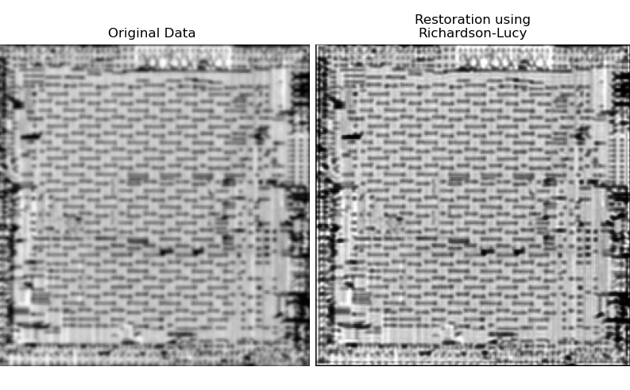
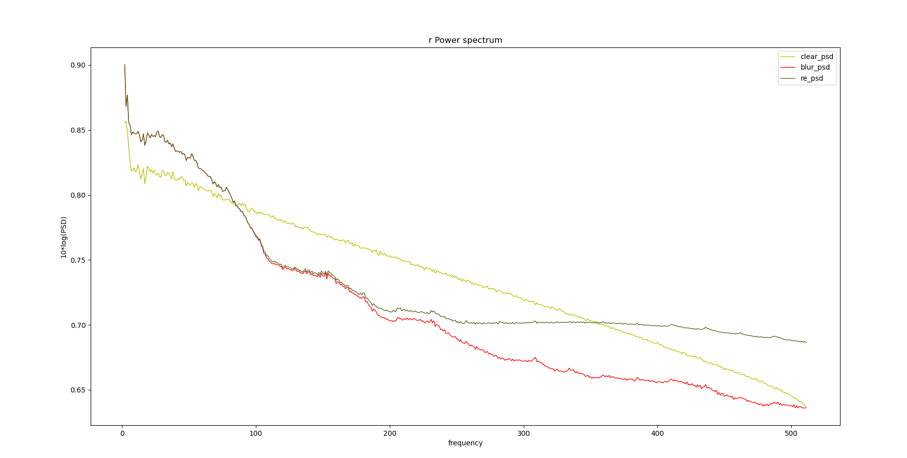

# Deconvlution
通过反卷积复原图像 

<table width="100%" border="0" cellspacing="0" cellpadding="0">
  <tr>
    <td align="center"> </td>
  </tr>
  <tr>
    <td align="center">Fig.1 Deconvolution result.</td>
  </tr>

  

<table width="100%" border="0" cellspacing="0" cellpadding="0">
  <tr>
    <td align="center"></td>
  </tr>
  <tr>
    <td align="center">Fig.2 Spectrogram comparison of images.</td>
  </tr>

